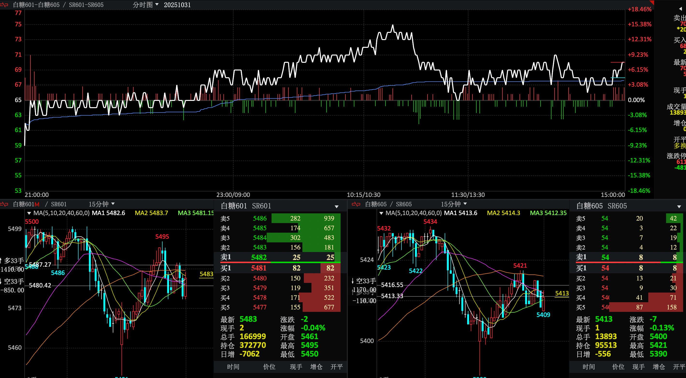

20251031
白糖1-5
收盘信息
ATR16
最高75
最低59
开盘59
收盘70

## 总结
### 失误：
排队单子较多，之前有想亏一个点买平减少仓位的单子一直挂着，第一波没有卖出，在第二波行情持续往下的过程中没有看到这个单子，导致亏损200多，纯属没有实时关注排队单子造成失误
### 注意：
实时关注排队单子是否符合当前行情走势

### 问题：
在72解锁第一波对锁多单后（在72解锁是，观测在72震荡多时，不能打破继续往上，感觉是解锁多单的好机会），解锁后因为观测到趋势还是要上涨（一腿强，二腿弱），在涨到73、74时，二次锁仓，导致锁仓区间拉大
### 注意：
解锁一边时，不能一次性解锁完，可以分多次解锁，如果上涨可以继续做多解锁，如果下跌，敞口不会因为一次解锁一边敞口变大

20251101
晚间
### 问题
开盘前自动单，挂了两边，开盘趋势往下，导致空单全出，对锁敞口，应该在自动单上挂空单开仓，平仓单做，或者平掉一部分，减少敞口
#### 晚间 趋势记录
1. 活动单往下
2. 空方从63到66有大佬，每个价格都有100张他的单子
3. 15分钟蜡烛图二腿稍强

1103上午记录
蜡烛图15分钟： 1腿稍弱、 2腿稍强
空方 在66～69上 较多，每个档位上午在200、300张，下午到了500 到700张，多方一档100多人，其他档位几十张
上午从58到65，一直不破66 ，在上升期间，一直在做多，但是上周有留多担，价格在71，在上升66之前一直做多，多单降均价拉到65，想在66一把把多担出去，因为此时空房66～69人数较多，且每个档位都均匀分布，在多次没有突破66时，此时判断66不好出，最后在65等价多单出去，此时只剩下63位置的空单，上午盘结束
1103下午记录
蜡烛图日线 ：1腿强、2腿弱
开盘前预测：下午会下跌，所以留有空单，预测原因是15分钟蜡烛图，二腿较强，且空方66到69做空人数较多，坐多人数较少
下午开盘基本不动，在63～65波动，不突破63、65，下午波动没有出去空单，在2点54分时，开始突破66，上升到68，此时手里没有多单，只能看着不能操作

总结：
不能单纯只看15分钟蜡烛图，需要关注日线图对比，今天上升趋势可以在日线图中看到苗头
依旧是一次把一边全部解仓出去，导致下午收盘前五分钟上升趋势没有把握住

收盘
