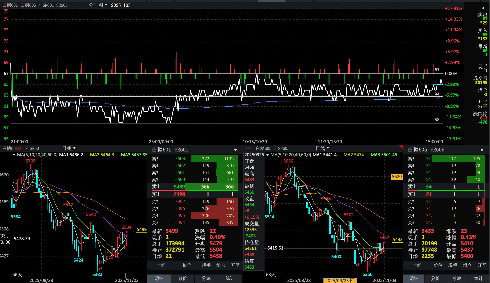
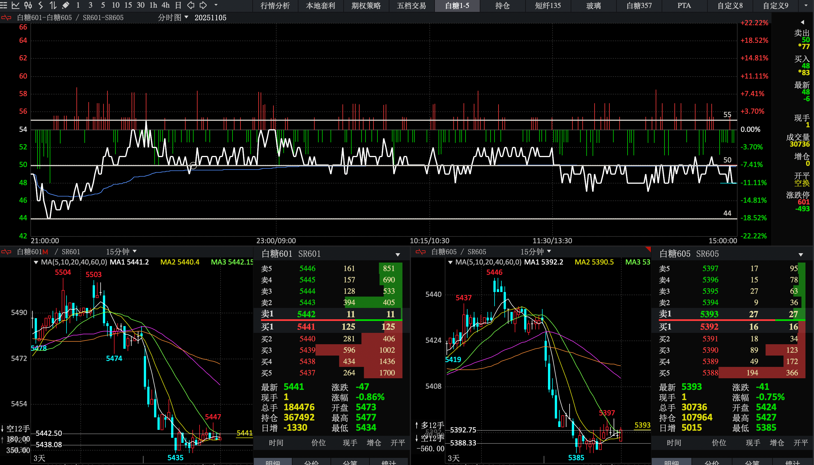
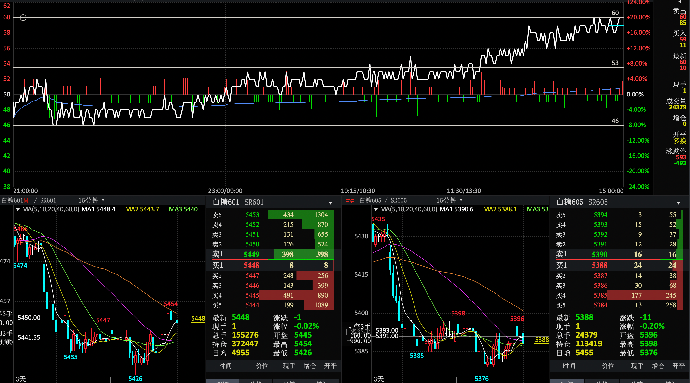
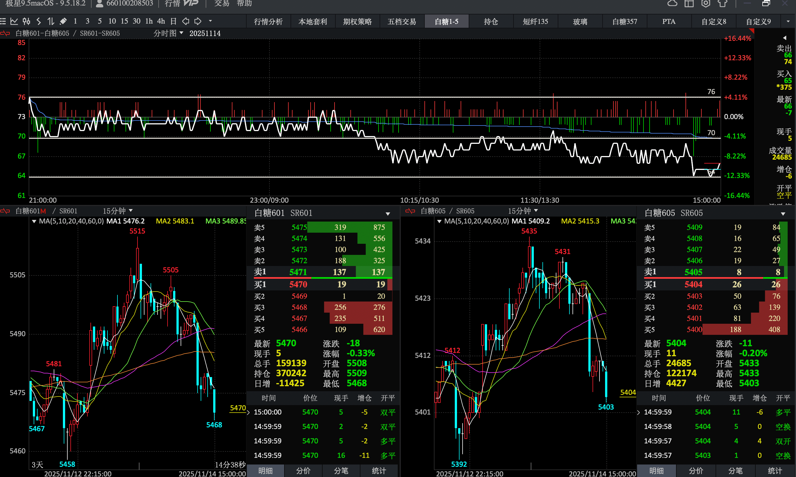
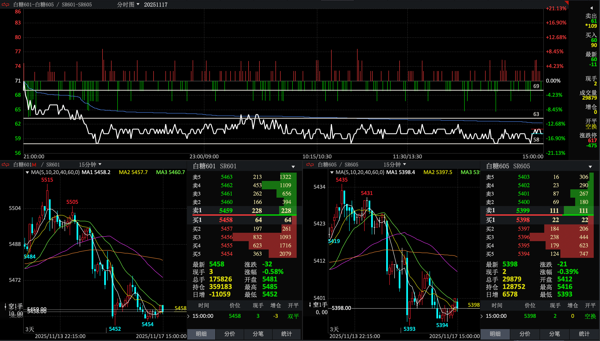
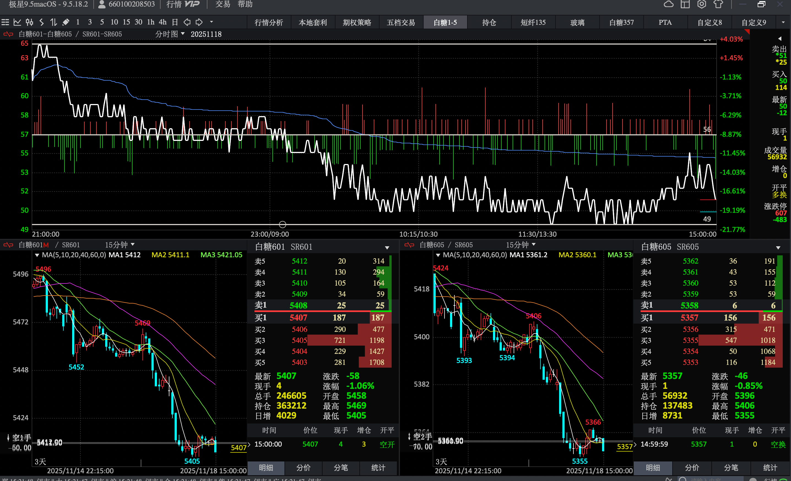

20251031
白糖1-5
收盘信息
ATR16
最高75
最低59
开盘59
收盘70

## 总结
### 失误：
排队单子较多，之前有想亏一个点买平减少仓位的单子一直挂着，第一波没有卖出，在第二波行情持续往下的过程中没有看到这个单子，导致亏损200多，纯属没有实时关注排队单子造成失误
### 注意：
实时关注排队单子是否符合当前行情走势

### 问题：
在72解锁第一波对锁多单后（在72解锁是，观测在72震荡多时，不能打破继续往上，感觉是解锁多单的好机会），解锁后因为观测到趋势还是要上涨（一腿强，二腿弱），在涨到73、74时，二次锁仓，导致锁仓区间拉大
### 注意：
解锁一边时，不能一次性解锁完，可以分多次解锁，如果上涨可以继续做多解锁，如果下跌，敞口不会因为一次解锁一边敞口变大

20251101
晚间
### 问题
开盘前自动单，挂了两边，开盘趋势往下，导致空单全出，对锁敞口，应该在自动单上挂空单开仓，平仓单做，或者平掉一部分，减少敞口
#### 晚间 趋势记录
1. 活动单往下
2. 空方从63到66有大佬，每个价格都有100张他的单子
3. 15分钟蜡烛图二腿稍强
1103上午记录
蜡烛图15分钟： 1腿稍弱、 2腿稍强
空方 在66～69上 较多，每个档位上午在200、300张，下午到了500 到700张，多方一档100多人，其他档位几十张
上午从58到65，一直不破66 ，在上升期间，一直在做多，但是上周有留多担，价格在71，在上升66之前一直做多，多单降均价拉到65，想在66一把把多担出去，因为此时空房66～69人数较多，且每个档位都均匀分布，在多次没有突破66时，此时判断66不好出，最后在65等价多单出去，此时只剩下63位置的空单，上午盘结束
1103下午记录
蜡烛图日线 ：1腿强、2腿弱
开盘前预测：下午会下跌，所以留有空单，预测原因是15分钟蜡烛图，二腿较强，且空方66到69做空人数较多，坐多人数较少
下午开盘基本不动，在63～65波动，不突破63、65，下午波动没有出去空单，在2点54分时，开始突破66，上升到68，此时手里没有多单，只能看着不能操作

总结：
不能单纯只看15分钟蜡烛图，需要关注日线图对比，今天上升趋势可以在日线图中看到苗头
依旧是一次把一边全部解仓出去，导致下午收盘前五分钟上升趋势没有把握住

收盘

20251104
今日做盘感觉：混乱 、没有发力点
没有明确的做空做多点位，只跟着盘口开仓，被拉后锁仓，锁仓后又着急解锁出来
在白天9点开盘下跌时，空单出去了，此时并没有方向判断，一味跟着盘口买入，以为是最低点，再稍有反方向波动后，又一味的着急锁仓，在后波动期间，又是混乱开仓，导致两边仓位很重，并且是对锁状态

20251105
整体过程记录：开盘前预测趋势会先下去，再上来，因为手里有锁着的单子，所以没有排很多自动单，只排了45很远的多单和65空单，在开仓五分钟内，多单成功，同时在出空单，买入多单，空单出完后，到45开始回调，期间有买入做多，后多单价格在46，在回调到51时，一直观察52波动好长时间过不去，感觉要在52、51波动，开始出多单，多单在51出去，此时单子全部出完
后开始预测会下跌，开始买入空单，在买入空单时，有上涨趋势到63、64，担心预测错误，开始对锁在52，看到坐多的人员较多，开始倾向与坐多，多单买了51，52，此时多单比空单要多，后续白天开始震荡，开始预测行情要往下，因为好长一段时间，做多人员比较多，但是价格一直上不去，在15分钟蜡烛图1、2腿中没有明显的一直一边强，此时开始亏欠出多单，后多单价格在50，空单价格也在50，但是还是多单的敞口大，
到下午后，一直想让行情到51把50的多单出去，之后，全心坐空单，但是行情一直没有破51，导致多单还是出不去，在最后五分钟，要从49下跌到48时，49还剩3张单子是，对着敲了6张50多单，赔钱锁在了50，此时空、多都锁在了50

总结，提前坐预测，今日预测对下去再上来行情，这波是赚钱的，后出多单锁仓时，虽然没有抓住最好的50出去，49也还行
记住：要在能力范围内等的起，不要慌

20251106
整体过程记录：开盘前预测地点43，高点55；
开盘手里有对锁的50的单子，各15张，在晚盘开盘后下跌时，空单出去，再回调51后，开始出多单，此时预测回到55后，白天会往下回调，便开始进空单，在进空单期间，趋势还是往上走，此时开始部分锁仓，锁仓期间在不断坐多单的平仓，到白天的盘后，还是持续上涨，进空单，进多单，出多单，一直是多单较少，空单较多，空单一直没有出，累了很多空单单子，到下午盘一直是震荡趋势，总买1完多，总卖1千多，此时五档盘口的单量只有几十张，说明大家此时多、空都不敢坐，最终没有回调；
一腿、二腿的涨幅比，下午有达到20左右，一直在上涨，这个是符合分析条件的，同时下午有段时间一腿涨幅是涨，二腿涨幅是跌，也应证了上涨的趋势

今日问题总结： 
因为手里面累计的空单较多，一直再幻想这下去把空单出去，导致在中午停盘前，到下午停盘前都是非常明确的上涨信号，虽然看到了信号，但是没有进仓，当时幻想这下午把空单出去，一直在思想上想让他下去，压制了我看到的上涨的信号，最终导致多单没有跟着进仓，空单还是挂着

20251107
整天过程
试一下开盘不做单，中间根据趋势找合适点进（适用于有回调的行情，白糖1-5大部分是有回调的行情），
当心急拉，一边走行情

一直对锁着出单子，看空就敞口在空，做空方，看多就敞口在多，做多方，
在一天当中不着急对锁，两边做，相当于在一直挪动两边多、空的价位，
到最后收盘前如果能在合理范围内砍就砍，不能砍就对着敲对锁

姨夫：
防守型打发，所有的操作不让被急拉着，今天不容易往哪个方向走，如果顺势硬要，如果逆势跟活动单

20251112
过程
今天从67到76一直做多
基本思路是大趋势在往上，一直跟着盘口做多，做一单，出一单，不给就等一下，有出不去的单的时候就关注一下是否有往下的趋势，有往下的趋势，达到三个点了，找机会做空，今天没有往下的趋势，一直是一腿比二腿强一些

20251113
过程
今天开始做视盘
一天做了9手，错1手（砍四个点-46），平1手（亏手续费-6），赚5手（净赚+20），锁2手（亏一个点解锁 -22）
错一手的总结
开盘比较慌，做错一手，开盘直线下，砍了四个点；总结：在心态不平和，趋势不明显的时候不排单子

对锁72的总结
对锁这一手的形成，72空单成了，有往上走的趋势，来到了74，没有破75，此时亏两个点就在想砍还是锁，最终选择锁，锁在72后又回调回来，导致对锁72
这一个锁做错的地方，这个时候应该以75作为一个锁仓标志，在75上有500单，应该在破75，或者75单子剩余100张的时候再考虑锁，锁的太草率了

对锁70、72的总结
在空72出去后，对锁的多72就敞口了，继续下跌，此时以70作为基准线，破了70，且单子剩余50张左右是空70锁了，在极速下跌的瞬间，空了70单子成了
此过程有个问题，其实破70的时候已经可以看出要往下走的趋势，此时应该多考虑一步，只考虑了空70对锁72，应该空70两单，这样有一单是空单的敞口（此方式较激进，但是如果趋势非常明显可以后续考虑）

20251117
过程

20251118
过程
开盘看多，从65下来，多单在60、61，之后一直有程序干涉，持续往下，直到51、50，在51把两张多单砍了，亏损190从上午十点半之后程序撤出，开始做多，几乎都是多单，看到49有600张支撑位，直到下午49单子快要出完，挂了51平仓单+51空开单，开仓单在后，想着成了51就撤掉，一直往下就锁一下，成了之后没来得及扯开仓单成
最终 剩余两张多单，一张空单  多50、51 空51

总结：
砍仓是其实在56就开始挂单子了，一直因为一个点没达到就在犹豫，导致最终砍在了最低点
决定砍仓，就关断砍，不要因为一个点达不到心里预期，就一直犹豫，因为此时已经到了底线，局势明朗，多砍一个点不影响，反而犹豫会一直持续砍不出来

