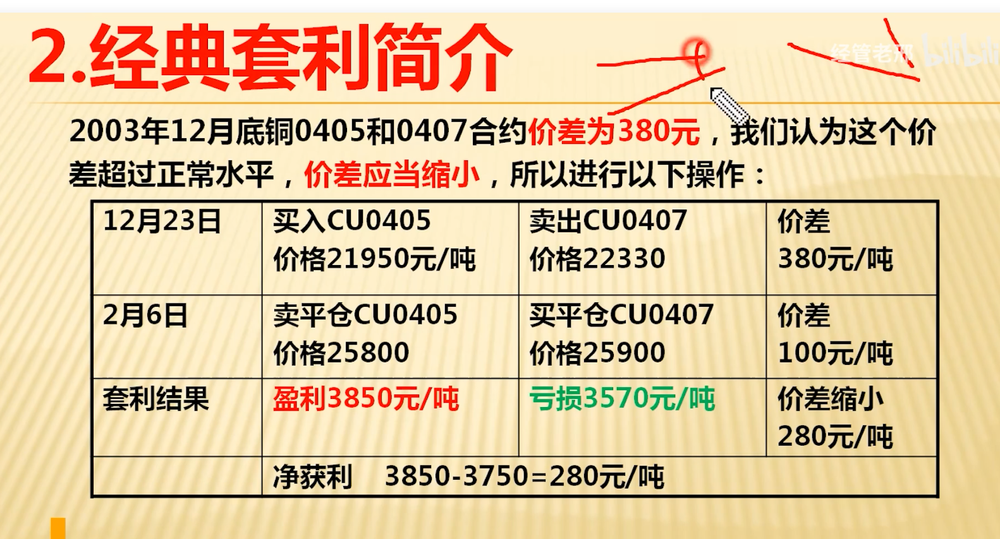
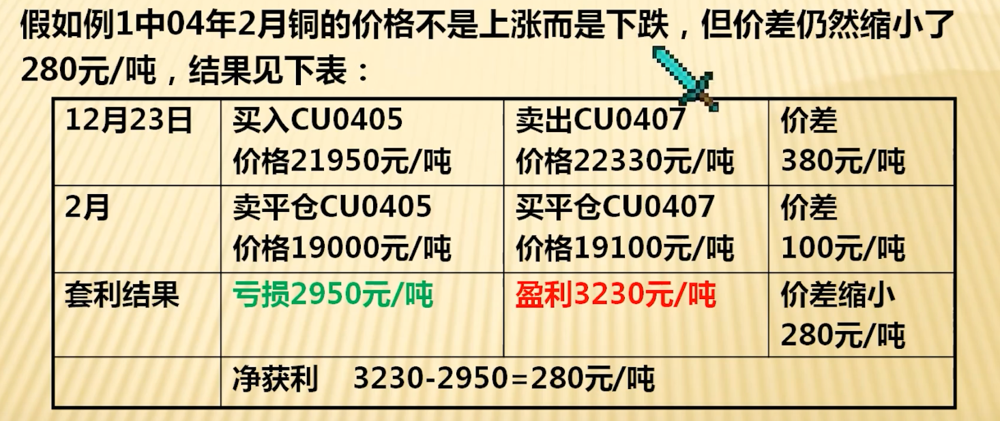
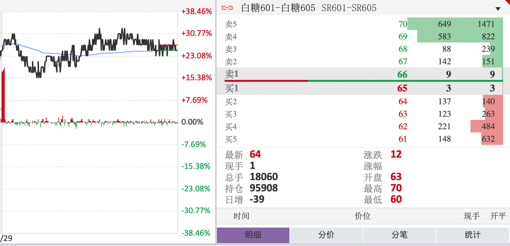
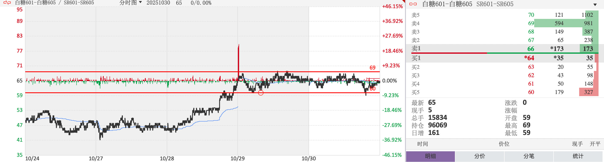
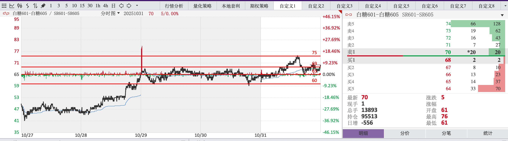
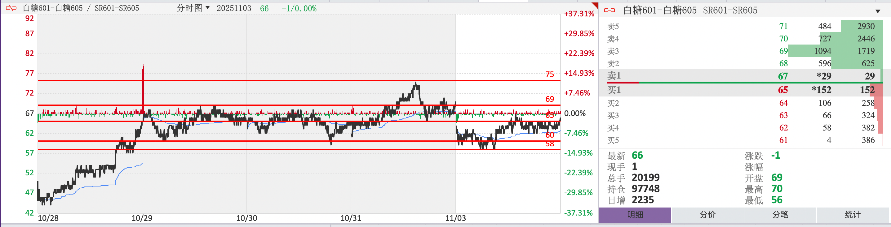

# future
feture work is life

## 踩坑经验

下面是基于实战的三条核心经验：

### 1) 交易纪律与执行力是基础
- 要点：交易纪律、执行力是所有可复制收益的基础。
- 建议：从 2w（20,000 元）起步练习，目标是达到“买卖无障碍”——能在任何给定信号下果断下单、止损与止盈。

### 2) 找到并固化自己的交易模式
- 要点：专注单一模式，减少策略切换带来的噪声。
- 目标：在可接受的风险下争取“单月成功率 ≈ 50%”或以上（视策略而定）。
- 步骤：
	- 严格记录每笔交易（理由/进出点/结果/情绪/手续费/滑点）。
	- 每周或每月复盘，分析失败原因，找出并去除“无效交易”（重复亏损或边际收益为负的交易）。
	- 当感觉“交易很无趣”时往往是好现象：说明系统在发挥作用，应把注意力转到控制回撤与执行质量上。
	- 经验提示：在资金从 2w 增长到 5w 的这个阶段，很多交易者会逐步“找到感觉”——即策略的稳定性和操作习惯逐渐成型。

### 3) 市场不按套路出牌，需要持续磨练
- 要点：市场本质上没有固定且永远有效的规律或捷径，需靠长期磨练、复盘与风险管理。
- 建议：建立交易日记与例行复盘（交易前计划 + 交易后复盘），定期回测并严格控制仓位、回撤与杠杆。

小结：纪律 + 单一可复现的模式 + 持续复盘 = 可持续的成长路径。把量化的执行（资金、胜率、回撤）当成检验标准，而不是直觉或运气。


# 期货相关名词解释


[//]: # (按类别拆分的期货术语表，增加“示例/常见误区”列)

## 基础概念

| 术语 | 解释 | 示例 / 常见误区 |
| ---- | ---- | ---- |
| 期货 | 在未来某一特定时间以约定价格买卖某种资产的标准化合约。 | 示例：以100元买入1手合约，交割月为6月。误区：认为期货等同于现货。 |
| 合约 | 期货合约的具体标准，规定标的、数量、质量、交割月、交割地点等。 | 示例：一手玉米合约代表特定数量的玉米。误区：以为合约可以随意修改。 |
| 交割 | 届时按合约规定完成实物或现金的交付与结算。 | 示例：部分合约采用现金交割，非所有合约都需实物交割。误区：以为所有投资者都要实际交割。 |
| 交割月 | 合约规定的可进行交割的月份。 | 示例：标注为2025年6月的合约在6月到期并可交割。误区：误以为可在任意月份交割。 |
| 结算 | 指交易所或结算机构在规定时点对买卖双方进行盈亏结算的过程（包含结算价的计算与资金调整）。 | 示例：每日结算将导致账户资金变动。误区：把“结算”仅等同于“交割”。 |
| 结算价 | 交易所每日用于结算、保证金计提和计算盈亏的参考价格。 | 示例：结算价用于计算逐日盈亏。误区：把结算价等同于某笔成交价。 |
| 昨结 | 昨日结算价，通常用于计算当日盈亏的参考基准。 | 示例：今结算价与昨结比较决定当日浮动盈亏。误区：误把昨结与昨日收盘价完全等同（交易所口径可能不同）。 |
| 逐日盯市 | 根据每日结算价逐日结算投资者的盈亏并调整保证金。 | 示例：每天账户权益会因为结算价波动而变动。误区：认为只是理论计算，不会影响可用资金。 |
| 基差 | 现货价格与期货价格之间的差值（现货 - 期货）。 | 示例：现货100元、期货95元，基差=5元。误区：以为基差固定不变。 |
| 杠杆 | 通过保证金制度，用较小资金控制较大合约价值的放大效应。 | 示例：保证金10%，理论杠杆约10倍。误区：只看到放大利润而忽视放大亏损。 |
| 持仓 | 持有的未平仓头寸，可指账户层面的仓位（含多空）。 | 示例：某账户持有2手多头。误区：把持仓等同于可自由支配的资金。 |
| 持仓量 | 某合约尚未平仓的合约总数（Open Interest）。 | 示例：持仓量上升可能表示有更多新仓进场。误区：将持仓量与成交量混淆。 |
| 现手 | 最新一笔成交的手数（成交量的即时值）。 | 示例：某笔撮合为3手，则现手=3手。误区：把“现手”当作日内总量。 |
| 成交量/总手 | 成交量通常指单位时间内的成交数量；“总手”常用作日累计成交量的口语。 | 示例：日内成交量5000手；今日总手20000手。误区：将成交量与持仓量混淆。 |
| 外盘 | 一般指主动买入成交量（买一价或买单主动成交），用于衡量买盘强度（不同平台定义略有差异）。 | 示例：外盘大于内盘时买盘更强。误区：外盘大并不必然代表主力在买入；需结合价位和大单分析。 |
| 内盘 | 一般指主动卖出成交量（卖一价或卖单主动成交），用于衡量卖盘强度。 | 示例：内盘大于外盘时卖压较强。误区：单看内/外盘无法判断主力意图，需结合成交量和价位。 |

## 交易操作

| 术语 | 解释                                                                                   | 示例 / 常见误区 |
| ---- |--------------------------------------------------------------------------------------| ---- |
| 开仓 | 建立新的持仓（买入或卖出合约）。                                                                     | 示例：买入合约建立多头。误区：以为开仓即等于成功赚钱的开始。 |
| 平仓 | 将已有持仓进行相反操作以关闭头寸。                                                                    | 示例：卖出相同合约以平掉多头。误区：延迟平仓可必然回本。 |
| 多头 | 预期价格上涨而持有买入方向头寸的一方（看涨）。                                                              | 示例：买入铜期货期待上涨。误区：将多头与持有现货等同。 |
| 空头 | 预期价格下跌而持有卖出方向头寸的一方（看跌）。                                                              | 示例：卖出原油期货预期跌价。误区：认为期货做空必须先借入标的（期货直接可以做空）。 |
| 价差交易 | 同一标的不同合约月或不同品种之间进行的价差套利或投机交易（Spread）。                                                | 示例：买近月、卖远月以捕捉基差变化。误区：忽视交易成本和滑点会侵蚀收益。 |
| 套期保值 | 为规避现货价格风险而在期货市场建立与现货相反方向的头寸。                                                         | 示例：农户卖出期货锁定收成价格。误区：认为套保能完全消除所有风险（仍有基差风险）。 |
| 对冲 | 与套期保值类似，目的是降低价格波动带来的风险。                                                              | 示例：机构用期货对冲现货敞口。误区：不等于完全无风险。 |
| 投机 | 以从价格波动中获利为目的的交易行为（承担价格风险）。                                                           | 示例：日内短线交易者捕捉价差。误区：把投机简单等同于赌博，忽视风险管理与策略。 |
| 多开 | 开设多头仓位（开多）。--买入开仓>卖出开仓，主动性买盘，持仓量增加                                                   | 示例：在看涨行情中买入开多一手。误区：认为开多必然获利，只需看涨方向即可。 |
| 空开 | 开设空头仓位（开空）。--卖出平仓>买入开仓，主动性卖盘，持仓量增加                                                   | 示例：预期下跌时卖出开空一手。误区：认为开空需要先借现货；期货可直接卖出开空。 |
| 多换 | 多头换仓，通常指将多头仓位从一个交割月或合约转换到另一个，以延续头寸或优化仓位（换月操作）。--  多头平仓与空头开仓成交，持仓量不变                  | 示例：把近月多头平掉并在远月建立等量多头以继续多头暴露。误区：认为换仓不产生成本，实际上有手续费和价差风险。 |
| 空换 | 空头换仓，类似多换但方向为空头。-- 空头开仓和空头平仓成交（空头开仓是卖出，空头平仓是买入，空换本省不增加或者减少持仓量，因为空单是由一个人的手里换到另一个人的手里） | 示例：在近月空头临近交割时换到远月空头。误区：忽视持仓滚动期间的基差风险和滑点。 |
| 双开 | 同时建立多头和空头的开仓操作（在某些平台或策略下用于锁仓或配对）。  --多头买入开仓，空头卖出开仓（交易双方同时开仓且数量相等，持仓量增加）              | 示例：为锁定价差同时对同一标的开多与开空。误区：并非所有平台都允许双向同时开仓，且存在额外成本和监管限制。 |
| 双平 | 同时平掉多头和空头头寸的操作（与双开对应）。--多头卖出平仓，空头买入平仓（交易双方同时平仓且数量相等，持仓量减少）                           | 示例：一次性清理账户时同时平掉多空头寸。误区：并非所有平台都有一键双平，且实际成交顺序和滑点需注意。 |

## 风险管理

| 术语 | 解释 | 示例 / 常见误区 |
| ---- | ---- | ---- |
| 保证金 | 开仓或维持持仓所需缴纳的资金担保（不是交易费用）。 | 示例：开仓需缴纳一定比例的保证金（如合约价值的5%）。误区：把保证金当作手续费或可随意支取的资金。 |
| 初始保证金 | 开仓时需要缴纳的最低保证金额。 | 示例：开仓时账户需满足初始保证金要求。误区：以为只在开仓时才存在保证金要求。 |
| 维持保证金 | 维持持仓所需的最低保证金，低于此水平可能被追加保证金或强平。 | 示例：账户权益低于维持保证金会收到追加通知或被强平。误区：认为维持保证金与初始保证金相同。 |
| 强制平仓（强平） | 当保证金不足且未及时追加时，交易所或经纪商强制平掉头寸以控制风险。 | 示例：未及时追加保证金，系统按规则自动平仓。误区：以为只由交易所直接操作，实际上经纪商通常执行风控。 |
| 爆仓 | 在连续亏损并被强制平仓后账户权益为零或接近零的情形（口语）。 | 示例：极端行情下账户被多次强平导致权益归零。误区：认为爆仓只在高杠杆下发生，实际极端波动亦可导致爆仓。 |
| 仓差 | 持仓量的日变化，通常用于观察资金流入/流出和仓位调整（见基础概念）。 | 示例：昨持仓1万手，今持仓1.1万手，仓差=1000手（增仓）。误区：单看仓差不足以判断多空力量，需结合成交量和价位分析。 |
| 保证金（数值示例） | 计算示例，帮助理解初始/维持保证金及爆仓触发： | 示例：假设1手合约名义价值=100,000元，交易所初始保证金10%、维持保证金6%。初始保证金=100,000×10%=10,000元；维持保证金=100,000×6%=6,000元。若账户只缴纳10,000元作为保证金，若市价导致亏损超过(10,000-6,000)=4,000元，即账户权益跌破6,000元，可能触发追加保证金或强制平仓。误区：不同合约和经纪商保证金比率不同，以上为示例。 |
| 爆仓（数值示例） | 对爆仓的数值说明： | 示例：延续上例，账户初始权益=10,000元，若市场出现较大波动导致未平仓亏损8,000元，账户权益变为2,000元，低于维持保证金且无法及时追加资金，经纪商被迫强平，若平仓价位继续不利则可能导致权益归零，即为爆仓。误区：爆仓也可能由于多仓/空仓的对手方滑点、手续费等综合影响造成，不能简单只看杠杆比例。 |

## 订单类型

| 术语 | 解释 | 示例 / 常见误区 |
| ---- | ---- | ---- |
| 市价单 | 以市场当前最优价格尽快成交的委托类型。 | 示例：在高流动性合约使用市价单可快速成交。误区：在低流动性或急速波动时可能遭遇严重滑点。 |
| 限价单 | 指定价格或更好价格成交的委托类型，可能无法立即成交。 | 示例：挂一个低于当前价的买入限价单等待回调成交。误区：认为限价单必然成交。 |
| 止损单 | 当价格触及预设触发价时转为市价单或限价单以限制进一步亏损。 | 示例：设置止损价以在不利行情时自动平仓。误区：在极端行情触发后可能以远离目标价的价格成交（滑点）。 |
| 止盈单 | 在达到目标利润价格时平仓以锁定收益的委托。 | 示例：设置目标价自动平仓锁定利润。误区：过早止盈可能放弃更大涨幅。 |

# 套利合约

## 跨期套利合约
利用一个或多个市场存在的各种价格差异，在不承担任何损失风险，且不需要投资者付出自有资金的情况下，赚取利润的交易策略或行为。
套利可以说是金融领域最灵活，最需要创造性，创新性思维的一种赚钱艺术。
### 牛市套利
```
在正向市场上（近低远高，基差为负），如果出现供给不足，需求旺盛，则将会导致近期月份合约价格的上涨幅度大于远期月份合约，或近期月份合约的跌幅小于远期月份合约，交易者可以通过买入近期月份合约的同时卖出远期月份合约而进行牛市套利。
```



近月买入、远月卖出，捕捉近月跑赢远月的价差收窄.

总结：
牛市套利的特点
套利者的损失有限，而获利的潜力巨大。
一、只有价差夸大，投资者才会出现亏损
二、无论价格升降，只要价差缩小即可获利

### 熊市套利
    在做法上正好和牛市套利相反，在正向市场上如果近期供给量正价，需求减少，则会导致近期合约价格跌幅大于远期合约，或近期合约价格的涨幅小于远期合约，交易者可以通过买入远期合约同时卖出近期合约而进行熊市套利。
### 蝶式套利
    123，321


# 交易过程
## 模拟盘
资金100w
### 20251029
#### 交易策略
套利合约白糖1-5 

收盘信息 
	
	ATR22
	最高66
	最低44

趋势

 	看多

止损点 

	跌破3个点直接砍掉

止盈点 
	
	一个点就平
行情

	震荡行情，先跌后涨，然后震荡，在局部成交为主

总结

	做盘思路要清晰，止损点，支撑点找好，涨跌都有应对的方法，做正确的事情，结果好坏都是今天行情的最优解。

### 20251030
#### 交易策略
套利合约白糖1-5 

收盘信息 
	
	ATR10
	最高69
	最低59

趋势

 	震荡行情

止损点 

	多价位出单，跌破60对锁

止盈点 
	
	一个点就平
行情

	震荡行情，先跌后涨，做多没有出，到60开始反弹，

总结

	在一腿二腿涨跌判断不出来谁强谁弱的时候，开始根据盘口单量下单，上午空方强做空，到了63支撑位开始一路做多，最后涨到65单子没有出完，以后尽量不留单子。
	在思路不清晰的时候尽量不要只做一个方向，尽早锁仓才能减小亏损。

### 20251031
#### 交易策略
套利合约白糖1-5 

收盘信息 
	
	ATR15
	最高76
	最低61

趋势

	计划按照震荡行情追盘口来做

 	

止损点 

	

止盈点 
	
	一个点就平
行情

	ATR突破常规认知10个点，一波从60涨到75，一波从75跌到65，其他时间震荡行情。

总结
	
	大致过程：
	按照前两天的经验价位在60-70之间震荡，今天按照60-65做多，66-70做空，
	但是上午涨到73、74时候开始锁空单子，到75之后开始做空，从75到65一路
	追空，把空单出的差不多的时候，在67，68，69开始做多，理由是有回调可能，
	结果就是空单出完了，手里一堆多单，在快收盘时候在68对锁多单。

	感悟：如果自己排的一个方向的兜底单子都打出来了，这个时候就要注意势头可能会
	超过预判的价位，这个时候就要在预测点位开始防御性锁单（或者开始反方向做单），
	提前缩小不可控敞口，而不是什么都不做，等待回到预测范围。

	思考：如何在对锁的情况下同时减少双边的单量，而不是一边先出完，留下另一边等待回调，
	当一个做盘周期回调不上来，就还要继续对锁，好像在做无用功。


### 20251103
#### 交易策略
套利合约白糖1-5 

收盘信息 
	
	ATR14
	最高70
	最低56

趋势

	先做空再平多，争取解套。

 	

止损点 

	

止盈点 
	
	一个点就平
行情

	ATR在14，总体先跌后涨，然后在65左右徘徊。

总结
	
	大致过程：
	前一天多空对锁到71和65，然后看盘口有下跌趋势，开始追空，加多，持续用空单的盈利来进多单拉低多单的均价，等到夜盘结束由于要过周末，多单价位调整到了65，收盘时候空单对锁到61，自动单挂在了出58，59平空，同时自动单在58，59持续在进多单，理由是继续用空单的盈利来拉低多单的均价，等待价格的回调，今天上午持续开始回弹，同时空单出完，手里只剩下多单，均价也拉低到60，等到价格回到65并且看盘口上空单很厚，感觉很难突破66时候，平完了多单，收益转正，下午震荡行情在64，65持续较劲时候整体看空，多空都买在了64，空单敞口多6张。

	感悟：在期货市场，看空看多都有理由，由于前天的对锁想解锁，就一直跟着盘口出一边的单子，先拿到一边的盈利，同时由于多单的持仓比越来越多，均价也被逐渐拉低，内心其实一直偏向看多，等待价格回调，在仓位允许的情况下，在ATR不是很大，并且有上下波动的合约中，这种方式确实可行，但是这是否能成为锁仓后的常规解锁手段，还要打一个问号，如果价格一直不回调到多单解套，仓位肯定会失控，到时候肯定会更被动。

	思考：如果多空双方的委托单量差距很大，甚至几倍，但是盘口价格却不是往单量多的一方在走，这个时候是否意味了，单量多的一方挂单都在五档之外，这时是否可以理解为单量多的一方有很多另一方的平仓单被套住了，并且价格很靠后，在没有大户出现在盘口时候，其实单量少的一方反而要的更坚决，看好单量少的一方来下单？